# MoA Pay

## 삼성 청년 SW아카데미(SSAFY) 11th 자율프로젝트

  

## 📆 프로젝트 진행 기간
2024.10.14 ~ 2024.11.19(5주)

## 🗿 멤버소개

  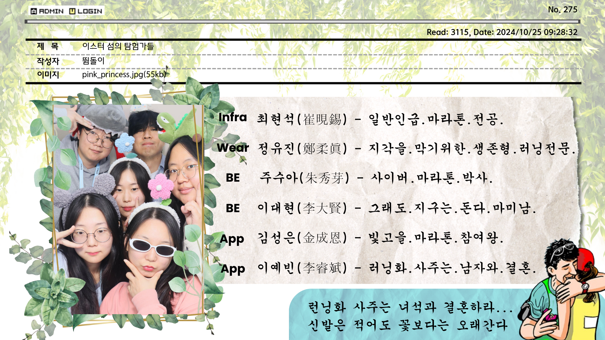

## 🤸‍♂️ 기술스택

<table>
    <tr>
        <td><b>Back-end</b></td>
        <td>

 

 

</td>
    </tr>
    <tr>
    <td><b>Front-end</b></td>
    <td>

    </td>
    </tr>
    <tr>
    <td><b>Watch</b></td>
    <td>
    
    
    </td>
    </tr>
    <tr>
    <td><b>Infra</b></td>
    <td>

</td>
    <tr>
    <td><b>Tools</b></td>
    <td>

    
    

    </td>
    </tr>
</table>

## 🛠️ 시스템 아키텍쳐

###

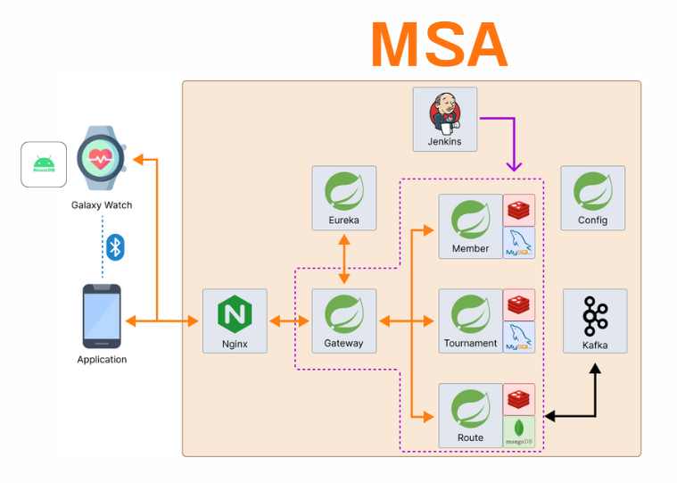

###

## 💳 프로젝트 소개

### 🚩 서비스 한줄 소개
마라토너를 위한 러닝 애플리케이션

 

### 기획의도 및 배경
러닝 기록을 체계적으로 관리하고자 하는 개인 러너 및 팀을 위해, 사용자가 경로를 따라 러닝하거나 경로 없이 자유롭게 달릴 수 있는 다양한 러닝 모드를 제공하며, 마라톤 정보 조회 및 신청 기능을 통해 복잡한 마라톤 참가 절차를 간소화하고자 함. 또한, 러닝 기록을 시각화하여 관리 효율성을 높이고 팀 기반 마라톤 참여를 활성화하는 것이 목표.
 

### 문제제기

**[문제제기 1]**
일일이 마라톤 정보를 확인하고 신청하는 과정이 번거롭다.

**[문제제기 2]**
마라톤을 뛰다보면 경로를 이탈하는 경우가 생기곤 하는데, 경로를 이탈했는지 판단이 어려울 때가 있다.

 
 

### 솔루션 도출

 

1. 마라톤 개최일, 접수 기간, 대회 장소, 종목 등 마라톤 정보를 한 눈에 확인할 수 있고 신청이 간편하도록 함
2. 경로 이탈 판단 로직을 구축하여 사용자가 러닝 도중 경로를 이탈했을 시 알림을 통해 실시간으로 경로 이탈 상황을 알려줌
 

### 서비스 목적

 

1. 마라톤 정보
- 흩어져있는 마라톤 정보 한곳에서 확인 가능
- 따로 홈페이지 이동 필요 없이 바로 신청하고 안전 수칙 고지 가능

2. 마라톤 참여
    2-1. 워치
           - 실시간 달린 km, 남은 km, 걸음수, 페이스, 시간 제공
           - 실시간 본인 및 친구들 위치 지도에서 확인 가능
           - 급수대, 반환점,  도착지 등 경로 정보 알람으로 제공
           - 경로를 벗어나면 알람
           - 마라톤 시작, 종료 버튼 클릭 가능
    2-2. 앱
           - 같은 마라톤에 참여하는 친구들과 모임 생성 가능
           - 친구들의 실시간 위치 확인 가능 및 최종 순위 제공 

3. 마라톤 연습
    3-1. 워치
         - 실시간 달린 km, 남은 km,  페이스, 시간 제공
         - 실시간 위치 지도에서 확인 가능
    3-2. 앱
          - 직접 달려서 트랙킹한 경로를 등록하고 공유 
 

### 기대효과

 

1. 개인 데이터 분석을 통한 마라톤 기록을 증진
2. 마라톤 접근성을 높여 마라토너 인구 증가
3. 마라톤 모임 생성 및 모임 등수 확인을 통한 동기부여

 

## ✅ 기능 소개

### 로그인

<table>    
    <tr align="center"> 
        <td><strong>초기화면</strong></td>
    </tr>
    <tr align="center"> 
        <td>  </td>
    </tr>
    <tr> 
        <td>
        사용자는 Google OAuth 로그인을 통해 간편하게 로그인할 수 있다.
        </td>
    </tr>
</table>

### 메인 화면, 팀 신청 알림
<table>    
    <tr align="center" > 
        <td><strong>메인화면</strong></td>
        <td><strong>팀 신청 알림</strong></td>
    </tr>
    <tr align="center"> 
        <td> 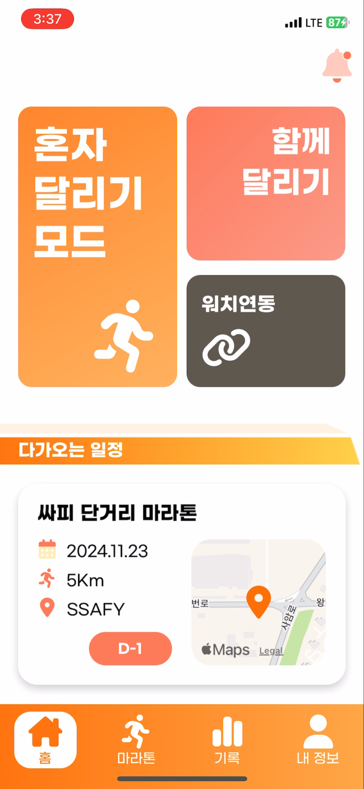 </td>
        <td> 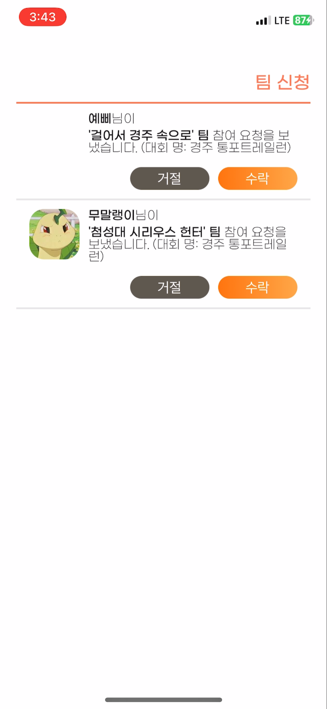 </td>
    </tr>
    <tr> 
        <td>
        오른쪽 상단 알림 아이콘을 통해 팀 초대 신청 유무를 확인할 수 있다. (팀 신청이 하나 이상 들어왔을 경우 아이콘이 활성화 표시로 바뀜)
        </td>
        <td>
        참여중인 마라톤에 대하여 팀 신청 알림 목록을 확인할 수 있다. 동일 마라톤에 대하여 다수에게 초대가 들어온 상황에서 하나의 팀을 수락한 경우, 다른 팀 신청이 자동으로 거절된다.
        </td>
</table>

### 혼자달리기 모드 선택

<table>    
    <tr align="center" > 
        <td><strong>모드 선택</strong></td>
    </tr>
    <tr align="center"> 
        <td> 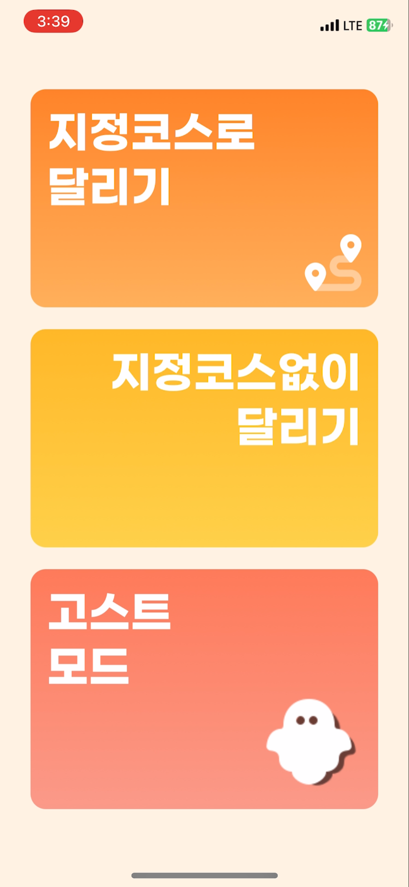 </td>
    </tr>
    <tr> 
        <td>
        사용자는 지정 코스로 달리기, 지정 코스 없이 달리기, 고스트 모드로 달리기 중 하나를 택해 달릴 수 있다.
        </td>
</table>

### 혼자달리기 모드_지정코스 O

<table>    
    <tr align="center" > 
        <td><strong>코스 선택</strong></td>
        <td><strong>경로 이탈</strong></td>
    </tr>
    <tr align="center"> 
        <td> 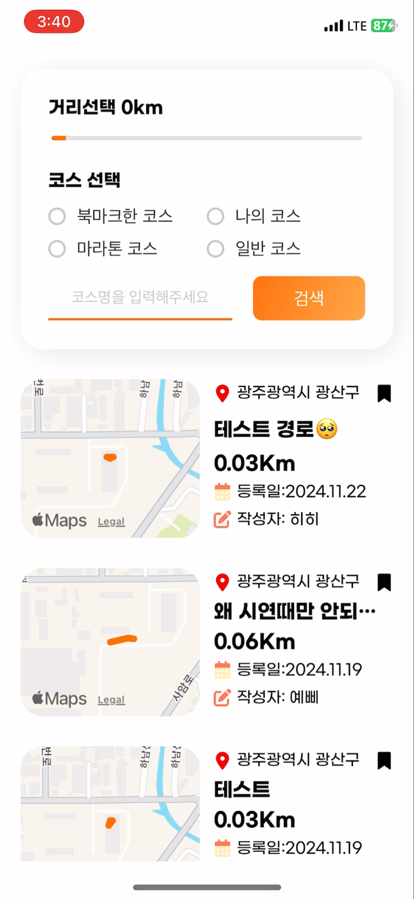 </td>
        <td> 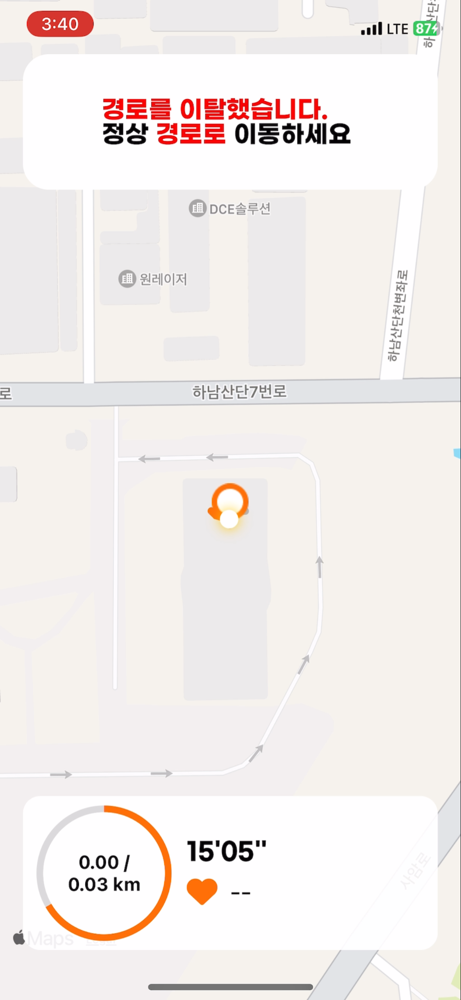 </td>
    </tr>
    <tr> 
        <td>
        실제 마라톤 코스 또는 다른 유저들이 등록한 코스를 선택해 달릴 수 있다. 코스 거리, 북마크 여부 등 필터링을 통해 코스를 검색하거나 코스명을 입력하여 검색할 수 있다.
        </td>
        <td>
        경로를 이탈했을 경우 화면의 알림을 통해서 사용자가 경로를 이탈했음을 알린다. 화면을 통해 실시간 위치를 파악할 수 있다.
        </td>
    </tr>
</table>

### 혼자달리기 모드_지정코스 X

<table>
  <tr align="center">
    <td><strong>시작 대기</strong></td>
    <td><strong>코스 기록</strong></td>

  </tr>
  <tr>
    <td>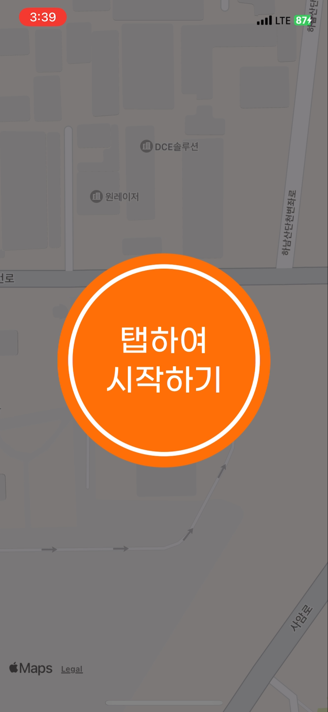</td>
    <td>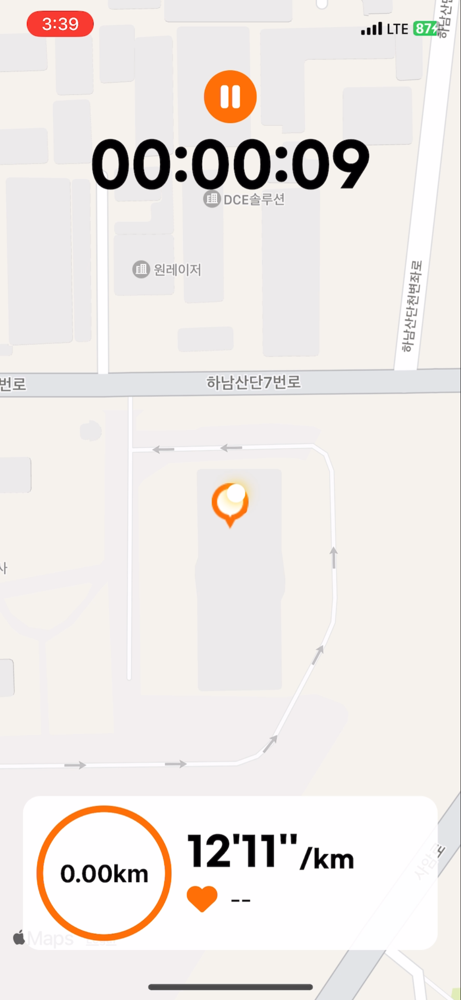</td>
  </tr>
  <tr>
    <td>
    시작 대기 버튼을 통해 사용자로 하여금 희망 코스 시작 지점에 위치한 후 시작할 수 있도록 한다.
    </td> 
    <td>
    위치 타임스탬프, 총 소요 시간, 총 이동 거리, 평균 페이스, 심박수가 기록되어 화면에 나타난다.
    </td> 
  </tr>
  
  <tr align="center"> 
        <td><strong>결과</strong></td>
    </tr>
    <tr align="center"> 
        <td> 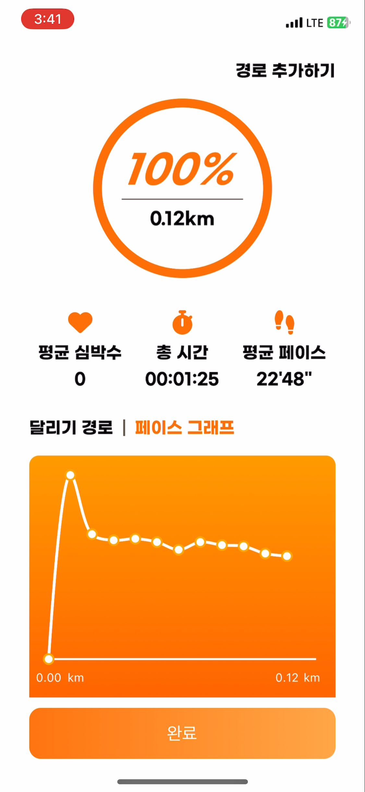 </td>
    </tr>
    <tr> 
        <td >
        종료 후 경로, 총 이동 거리, 시간, 심박수, 평균 페이스와 그래프를 제공한다. 사용자는 경로 추가하기 기능을 통해 본인이 뛰었던 경로를 등록할 수 있다.
        </td>
    </tr>
</table>

### 기록

<table>
  <tr align="center">
    <td><strong>기록 목록</strong></td>
    <td><strong>기록 상세</strong></td>
  </tr>
  <tr>
    <td>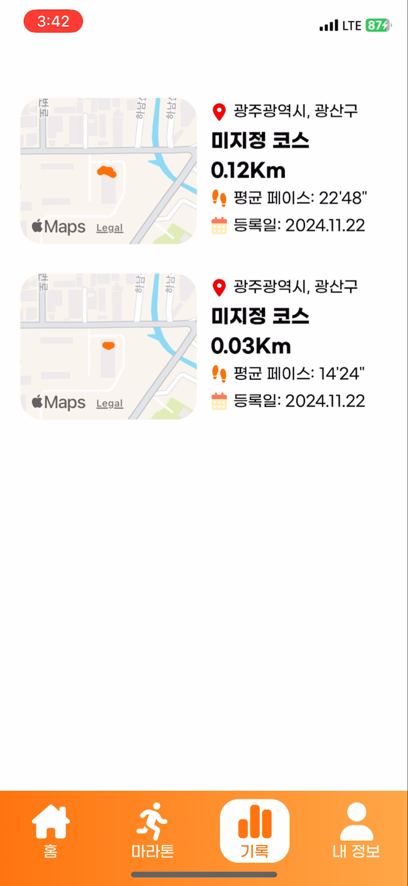</td>
    <td>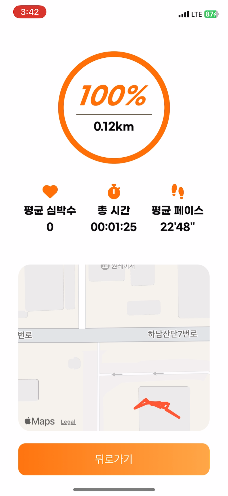</td>
  </tr>
  <tr>
    <td>
    사용자가 지금까지 뛰었던 기록(혼자 달리기 모드, 실제 마라톤 기록 등)이 리스트 형태로 보여진다.
    </td>
    <td>
    자취, 평균 심박수, 총 소요 시간, 평균 페이스, 달성률 등의 상세 정보를 확인할 수 있다.
    </td> 
  </tr>
</table>

### 마라톤 정보

<table>    
    <tr align="center" > 
        <td><strong>대회 목록</strong></td>
        <td><strong>대회 상세1</strong></td>
    </tr>
    <tr align="center">
        <td> 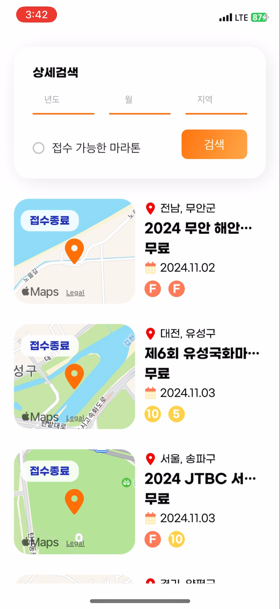 </td>
        <td> 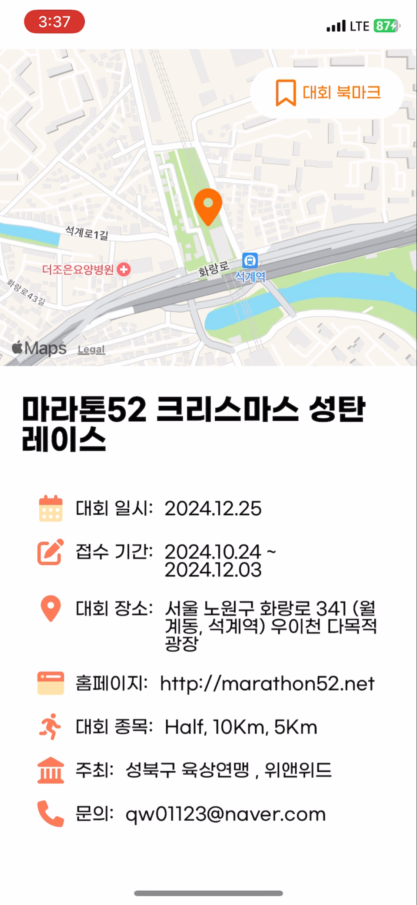 </td>
    </tr>
    <tr> 
        <td>
        접수 중인 마라톤 및 접수 종료된 마라톤들을 확인할 수 있다. 년도와 지역, 접수 가능 유무를 통해 필터링된 검색이 가능하다. 
        </td>
        <td>
        대회 일시, 접수 기간, 대회 장소, 홈페이지, 종목 등 마라톤 관련 상세 정보를 한 눈에 확인할 수 있다. 북마크 기능을 통해 대회 북마크가 가능하다.
        </td>
    </tr>
    <tr align="center"> 
        <td><strong>대회 상세2</strong></td>
        <td><strong>팀 인원 추가</strong></td>
    </tr>
    <tr align="center"> 
        <td> 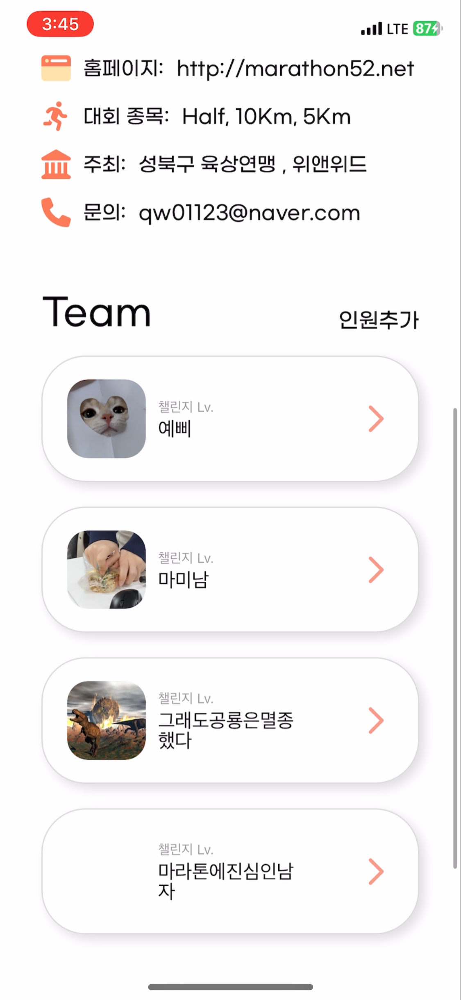 </td>
        <td> 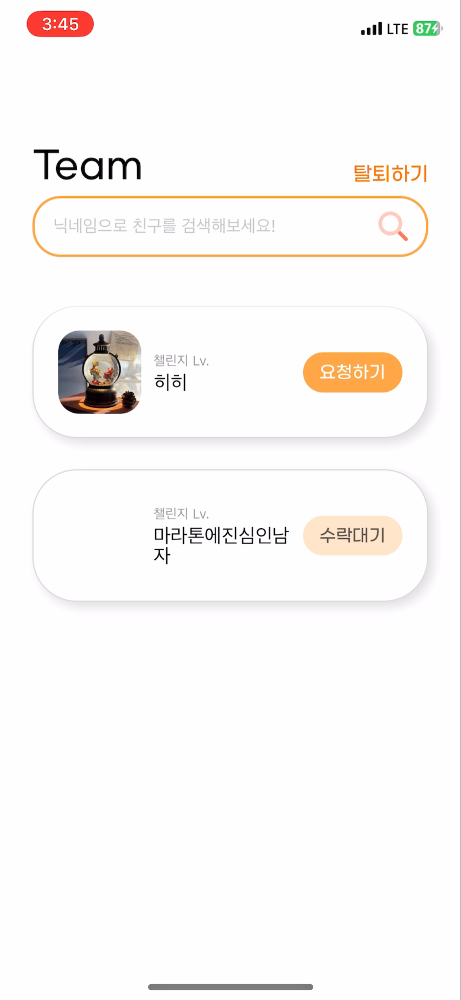 </td>
    </tr>
    <tr> 
        <td >
        마라톤 신청 가능 유무, 마라톤 신청 유무, 팀 결성 유무에 따라 상세 정보화면 하단이 다르게 노출된다. 팀이 결성되었을 경우 팀원들의 정보가 보이게 된다.
        </td>
        <td>
        인원 추가 기능을 통해 마라톤을 신청했지만 아직 어떠한 팀에도 가입되지 않은 사람을 팀에 초대할 수 있다. 닉네임을 통한 검색 기능을 제공한다. 팀 탈퇴를 원할 경우 탈퇴하기 버튼을 통해 팀에서 빠져나올 수 있다.
        </td>
    </tr>
</table>

### 

<table>    
    <tr align="center" > 
        <td><strong></strong></td>
        <td><strong></strong></td>
    </tr>
    <tr align="center">
        <td>  </td>
        <td>  </td>
    </tr>
    <tr> 
        <td>
        </td>
        <td>
        </td>
</table>
<table>    
    <tr align="center" > 
        <td><strong></strong></td>
        <td><strong></strong></td>
    </tr>
    <tr align="center">
        <td>  </td>
    </tr>
    <tr> 
        <td>
        </td>
        <td>
        </td>
</table>

## ⚒️ 담당 역할 및 기여
- **역할:** 
  - FrontEnd 개발, UX/UI 디자인, 경로 이탈 로직, 멤버, 마라톤 정보 디테일, 러닝 기록, 초대 알림

- **기여:**

  - 경로 이탈 로직
      
      경로 이탈 로직을 작성하여 사용자가 기존에 등록 된 경로를 따라 이동 중 어떤 기준으로 경로를 벗어났다고 판단할지에 대한 방향성을 제시함
      
  - UX/UI 디자인 및 피그마 작업:
      
      직관적이고 사용성 높은 화면 설계를 위해 피그마를 활용하여 러닝 및 마라톤 관련 UI/UX 디자인을 개발.
      
  - 러닝 기록 및 상세 조회 기능 구현:
      
      사용자 러닝 기록을 조회하고, 날짜별 상세 기록을 확인할 수 있는 기능 개발.

## ⚒️ 사용 기술, 구현 기술 설명

### 사용 기술
- **사용 기술:** 
  - React Native, JavaScript, Zustand
- **선택 이유:** 

  - **React Native**
      
      하나의 코드베이스로 iOS와 Android 앱을 동시에 개발할 수 있어 개발 속도가 빠르고, 러닝 관련 실시간 기능과 인터랙티브한 UI를 구현하는 데 적합했기 때문.
      
  - **JavaScript**
      
      러닝 모드 및 경로 이탈 로직을 구현하기 위한 동적 데이터 처리를 효율적으로 지원하며, React Native와 자연스럽게 연계할 수 있기 때문.
      
  - **Zustand**
      
      가볍고 사용이 간단한 상태 관리 라이브러리로, 러닝 기록, 사용자 정보, 로그인 상태와 같은 글로벌 상태 관리를 효율적으로 처리하기 위해 선택함.

### 구현 사항

- **멤버**
    - 회원가입 및 Google OAuth 로그인으로 사용자 편의성 향상
    - Zustand를 통한 멤버 상태관리
    - Async Storage를 활용하여 로그인한 사용자 정보를 저장하고 자동 로그인 기능을 구현함
- **마라톤**
    - 마라톤 정보 디테일 조회 및 대회 일시 디데이 제공
    - 마라톤 북마크 및 마라톤 신청 기능 구현
        - 접수 마감일이 지난 마라톤에 대하여 신청이 불가하도록 함
        - 사용자의 정보를 기반으로 마라톤 신청서에 자동 입력되도록 하여 편리성 제공

- **팀 기능**
    - 팀 초대/초대 취소/초대 수락/초대 거절 기능
        - 동일 마라톤 참가자들에 한해 유저 검색 기능을 제공하고, 검색된 유저끼리 마라톤 팀 생성 및 탈퇴할 수 있도록 함
        - 다른 팀에 소속되지 않은 유저에 한해 팀 초대 신청을 할 수 있으며, 초대한 유저에 대해 초대 취소가 가능하도록 함
        - 같은 마라톤에 대하여 여러 팀에서 초대 신청이 들어왔을 경우, 사용자가 수락한 팀을 제외한 모든 팀에 대해서 자동 거절 되도록 함
        - 초대 신청이 들어온 마라톤에 대하여 이미 다른 팀에 소속되어 있을 경우, 초대 수락이 불가하도록 함
- **알림**
    - 팀 초대가 왔을 시 홈 화면 알림 아이콘 활성화 표시를 통해 초대 신청 유무를 알 수 있게 함
- **러닝 기록**
    - 러닝 기록 전체 조회 및 상세 조회
        - 달리기 모드 혹은 마라톤 대회 참가로 인해 생긴 러닝 기록을 기록 탭에서 확인할 수 있음

 

## 📕 산출물(ERD, 명세서, 파일구조)

### ERD

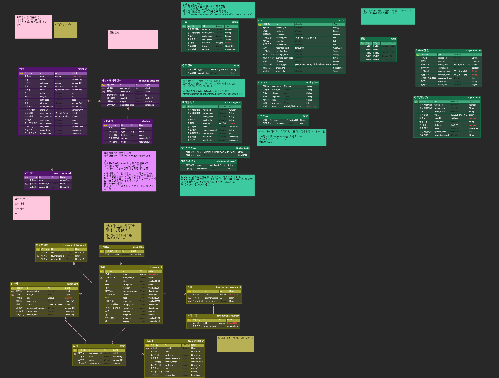

### 명세서

[API 명세서](https://docs.google.com/spreadsheets/d/1xHqWLq37ckSDkoltuPQX1Qg-oftulXuR1f5l1B_K1mA/edit?gid=0#gid=0)

## 💸 결과공유, 느낀점

### 성과, 결과
**성과 :**
- **UX/UI 최적화 및 상태 관리 개선:**

  - Google OAuth 로그인, 마라톤 북마크, 팀 초대 알림 등에서 직관적이고 효율적인 사용자 경험 제공.
- **경로이탈 로직 구현:**
  
  - 마라톤 참가자를 대상으로 한 수요조사를 토대로 경로 이탈 판단 로직을 구현함

**결과 :**

- 스크롤 기능이 잘 되지 않음, 업로드한 프로필 사진의 용량 크기가 클 경우 로드 시간이 오래 걸림

### 느낀점

처음 React Native를 이용해봤는데 개념을 모르는 채로 무작정 구현하는 것에만 초점을 맞추고 하니 CSS 깨짐 및 갖가지 문제점들이 발생했었던 것 같다. 이번 경험을 통해 기초 개념 학습과 체계적인 접근이 얼마나 중요한지 깨달았고, 앞으로는 기본을 탄탄히 다진 후 프로젝트에 임해야겠다고 느꼈다.

## 발표자료

[ 발표자료 ]

## 🎬 UCC링크

[Ucc](https://youtu.be/p7wxT1e5HAY)
